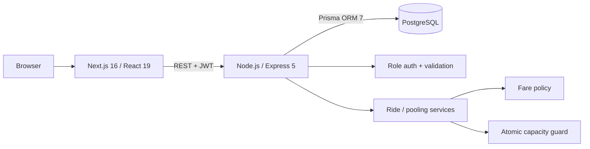

# Dhaka Tesla Pool

> **Share a seat. Split the fare. Survive Dhaka traffic.**

A production-minded ride-pooling MVP for the RoBenDevs Software Engineer Internship challenge. Passengers request rides across predefined Dhaka zones, compatible requests share **Bullet**, Jashim's three-seat Tesla, and the system keeps capacity, individual fares, authorization, ride status, and history consistent.

**Live Demo:** `ADD_VERCEL_URL_BEFORE_SUBMISSION`  
**API:** `ADD_RENDER_URL_BEFORE_SUBMISSION`  
**6-minute walkthrough:** `ADD_VIDEO_URL_BEFORE_SUBMISSION`

## Story and product problem

At rush hour, Nusrat requests Banani -> Mohakhali. Rafiq requests Banani -> Gulshan 1. The routes are compatible, so they can share Bullet if capacity allows. Shirin is the final-seat concurrency case. Jashim needs a clear driver queue and lifecycle; each passenger must see only their own fare/status.

The engineering problem is intentionally about **data integrity and lifecycle design**, not rebuilding Google Maps.

## Implemented MVP

### Passenger

- Sign up/sign in with role-protected API access
- Request pickup, destination, seat count, and Cash/TeslaPay
- See a deterministic estimated fare
- Automatically join a compatible candidate/accepted pool
- Track waiting -> matched -> driver arrived -> in progress -> completed/cancelled
- Cancel only before trip start
- View own ride history without seeing another passenger's private fare/status

### Driver / Bullet

- Jashim signs in as the seeded driver
- Toggle Bullet online/offline
- See candidate and active pools, passengers, routes, seats, fares, and payment method
- Accept pool -> mark arrival -> start -> complete
- One accepted/in-progress pool per vehicle; additional candidate pools can queue
- Driver history retained

### Pooling and integrity

- Compatible route matching using predefined Dhaka corridors
- Fixed vehicle capacity snapshot per pool
- Atomic conditional reservation of `reservedSeats`
- PostgreSQL check constraint: reserved seats can never exceed capacity
- Per-passenger fare stored in integer poysha
- Status history for both rides and pools
- Pool fare recalculation when a passenger joins/leaves

## Architecture



Full architecture and lifecycle: [`docs/ARCHITECTURE.md`](docs/ARCHITECTURE.md)  
Database ERD: [`docs/ERD.md`](docs/ERD.md)  
Decision log: [`docs/DECISIONS.md`](docs/DECISIONS.md)

## Database model

Core tables:

- `User` — passenger/driver identity and credentials
- `Vehicle` — Bullet, driver ownership, online state, fixed capacity
- `RideRequest` — passenger route, seats, status, solo/final fare, payment method
- `Pool` — assigned vehicle, status, capacity snapshot, atomic reserved-seat counter
- `PoolMember` — explicit ride-to-pool membership and individual fare
- `RideStatusHistory` / `PoolStatusHistory` — auditable transitions

PostgreSQL is a deliberate choice over MongoDB/SQLite because pooling relies on relationships, transactions, constraints, indexes, and concurrent writes.

## Matching rule

No paid map/routing API is used. Each predefined zone belongs to a coarse corridor. Requests may share a pool when:

1. the pool is still REQUESTED or MATCHED;
2. pickup zones are the same or in a compatible pickup corridor;
3. destination zones are in the same compatible corridor; and
4. the requested seats fit the remaining capacity.

For the demo, Banani -> Mohakhali and Banani -> Gulshan 1 are compatible.

## Fare model

Money is stored as **integer poysha** rather than floating-point Taka.

```text
perSeatSubtotal = Tk 50 base + (distanceKm × Tk 20)
pooledFare = subtotal - 20%
total = perSeatFare × requestedSeats
```

Hand-checkable demo:

| Passenger | Route | Distance | Solo | Pooled |
|---|---|---:|---:|---:|
| Nusrat | Banani -> Mohakhali | 3 km | Tk 110 | **Tk 88** |
| Rafiq | Banani -> Gulshan 1 | 2 km | Tk 90 | **Tk 72** |

## Concurrency: Bullet has one seat left

The API does **not** do this unsafe sequence:

```text
read seats -> see 1 available -> insert membership
```

Instead, joining an existing pool performs a conditional atomic database update inside a transaction:

```sql
UPDATE "Pool"
SET "reservedSeats" = "reservedSeats" + :requestedSeats
WHERE id = :poolId
  AND "reservedSeats" <= "capacitySnapshot" - :requestedSeats;
```

Only the transaction that updates one row is allowed to insert its `PoolMember`. PostgreSQL also enforces `reservedSeats <= capacitySnapshot`. The integration test launches two concurrent claims against the final seat and expects exactly one success.

At larger scale I would evolve this toward explicit idempotent reservations/locking based on measured contention, not add Redis or queues to the MVP without evidence.

## Tech stack and justification

| Choice | Pick | Why here | Realistic alternatives / switch trigger |
|---|---|---|---|
| Frontend | Next.js 16 + React 19 + TypeScript | Clear routing, modern React, deploys cleanly on Vercel | Plain React/Vite if SSR/routing conventions add no value |
| Backend | Express 5 + TypeScript | Small explicit REST surface; easy to inspect/test | Fastify/Nest if performance or larger-team conventions justify it |
| Database | PostgreSQL | Transactions + relational invariants + concurrency | SQLite for local-only prototype; other stores only for a concrete workload |
| ORM | Prisma 7 | Type-safe schema, migrations, fast iteration | Drizzle/Kysely/raw pg for SQL-heavy hot paths |
| Validation | Zod | Shared mental model for request/env validation | Valibot/Joi if ecosystem/team changes |
| Auth | Short-lived JWT | Stateless, simple API demo | Production browser app: secure HTTP-only session/refresh strategy |
| Tests | Vitest + Supertest | Fast unit/API integration testing | Node test/Jest depending team standard |
| Local runtime | Docker Compose | One reproducible command for web/API/Postgres | Managed dev environment if team tooling changes |
| Hosting | Vercel + Render + Neon | Free-tier internship demo | Consolidate or move when reliability/latency/cost requirements change |

More detail: [`docs/DECISIONS.md`](docs/DECISIONS.md).

## Project structure

```text
dhaka-tesla-pool/
├── apps/
│   ├── api/
│   │   ├── prisma/             # schema, migration, seed
│   │   ├── src/domain/         # fare, zones, lifecycle rules
│   │   ├── src/services/       # pooling, ride, driver business logic
│   │   ├── src/routes/         # REST endpoints
│   │   └── tests/              # unit + integration
│   └── web/
│       ├── app/                # Next.js App Router pages
│       ├── components/
│       └── lib/
├── docs/                       # architecture, ERD, decisions, scaling, video
├── scripts/
├── docker-compose.yml
└── render.yaml
```

## Demo credentials

After seeding, all accounts use password `Demo123!`.

| Actor | Role | Email |
|---|---|---|
| Jashim | Driver | `jashim@dhakapool.dev` |
| Nusrat | Passenger | `nusrat@dhakapool.dev` |
| Rafiq | Passenger | `rafiq@dhakapool.dev` |
| Shirin | Passenger | `shirin@dhakapool.dev` |

Vehicle: **Bullet**, capacity **3**, seeded online.

## Run with Docker

Prerequisite: Docker Desktop / Docker Engine with Compose.

```bash
cp .env.example .env
docker compose up --build
```

Open:

```text
Web: http://localhost:3000
API health: http://localhost:4000/health
```

The API container deploys the checked-in migration and runs the idempotent demo seed before starting.

## Run without Docker

Prerequisites: Node.js 22+, npm, PostgreSQL.

```bash
# from repository root
npm install

cp .env.example .env
# edit DATABASE_URL and JWT_SECRET

npm run db:generate --workspace @dhaka-tesla-pool/api
npm run db:deploy --workspace @dhaka-tesla-pool/api
npm run db:seed --workspace @dhaka-tesla-pool/api

# terminal 1
npm run dev:api

# terminal 2
npm run dev:web
```

## Tests

Risk-focused tests cover:

- Nusrat/Rafiq fare math
- lifecycle transition rules
- pooled fare update/reversal
- one passenger cannot cancel another passenger's ride
- cancellation rejected after STARTED
- invalid driver state jump rejected
- two concurrent claims cannot overbook Bullet's final seat

Docker test profile:

```bash
docker compose --profile test run --rm api-test
```

or, with a test PostgreSQL URL configured:

```bash
npm test
```

## API overview

See [`docs/API.md`](docs/API.md). The API is REST because the MVP has a small, command-oriented resource surface and role boundaries that are easy to inspect in Postman/Supertest.

## Security basics

- Passwords hashed with bcrypt
- Short-lived signed JWTs
- Role middleware for passenger/driver endpoints
- Zod request/environment validation
- Helmet security headers
- Explicit CORS origin
- 100 KB JSON body limit
- No secrets committed; `.env.example` only
- Passenger ride queries are always scoped by authenticated passenger ID

**Known auth trade-off:** the demo web client stores its short-lived JWT in `sessionStorage`. A production consumer application should use a hardened HTTP-only session/refresh-token approach, session revocation, stronger rate limiting, and additional account protections.

## Git workflow

The repository intentionally preserves the engineering path:

```text
master
  ├─ feature/architecture-data-model
  ├─ feature/passenger-auth
  ├─ feature/tesla-pooling
  ├─ feature/driver-flow
  ├─ feature/frontend
  └─ feature/testing-docker
       ↓
pre-release
       ↓
release/v1.0.0
```

Commit format follows:

```text
<type>(<scope>): <short description>
```

Examples in the actual history include `feat(pool): ...`, `fix(pool): ...`, `test(pool): ...`, and `build(docker): ...`.

## Deployment

Free-tier instructions: [`docs/DEPLOYMENT.md`](docs/DEPLOYMENT.md).

Expected production demo topology:

```text
Vercel (Next.js) -> Render (Express API) -> Neon (PostgreSQL)
```

## Known limitations

- Static Dhaka zones and deterministic distances, not real GPS/routing/ETA
- One seeded driver/vehicle is the primary demo scenario
- No real payment gateway; TeslaPay is simulated
- No realtime socket; dashboards poll every few seconds
- No password reset, email verification, rating, notification, or admin workflow
- Render free hosting may cold-start after idle time
- Matching is deliberately simple and not an optimization engine

These are scope choices, not hidden gaps. The MVP prioritizes correct ownership, state, capacity, and auditability.

## Next improvements

1. PostGIS/geospatial driver matching + routing/ETA provider
2. Realtime trip updates and live driver location
3. Idempotency keys for mutation endpoints
4. Secure cookie/refresh-token session system and rate limiting
5. Scheduled rides, ratings, notifications, and real payment-provider integration
6. Observability with structured logs, metrics, traces, and SLOs

Scale reasoning for 1M passengers / 100k drivers: [`docs/SCALING.md`](docs/SCALING.md).

## AI usage disclosure

AI was used openly as an engineering assistant, consistent with the challenge policy.

- **Tool used:** ChatGPT
- **Used for:** architecture review, implementation scaffolding, test-case design, documentation structure, and code review prompts
- **Accepted suggestion:** keep pool capacity in PostgreSQL with an atomic conditional `reservedSeats` update plus a database check constraint; this directly protects the final-seat race without extra infrastructure
- **Changed suggestion:** the initial auth-client direction was tightened from persistent browser storage to `sessionStorage`, with the production limitation documented rather than presenting demo JWT storage as production-ready security
- **Rejected complexity:** Redis, Kafka/queues, Kubernetes, and microservices were intentionally kept out of the MVP because the current problem does not justify them

**Ownership note:** before submission, I will locally run, review, test, and deploy the generated/assisted implementation and make sure I can explain, modify, and debug the schema, auth, fare model, pooling algorithm, concurrency control, lifecycle, tests, and deployment choices.

Development workflow and commit-timeline context: [`docs/DEVELOPMENT_PROCESS.md`](docs/DEVELOPMENT_PROCESS.md).

## Video and submission

Walkthrough plan: [`docs/VIDEO_SCRIPT.md`](docs/VIDEO_SCRIPT.md)  
Application-form guide: [`docs/SUBMISSION_GUIDE.md`](docs/SUBMISSION_GUIDE.md)  
Final checklist: [`docs/FINAL_CHECKLIST.md`](docs/FINAL_CHECKLIST.md)

---

In Dhaka, the Tesla may have three wheels. The database constraints still have four.
