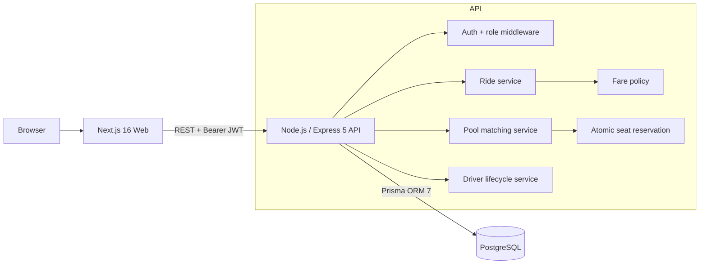
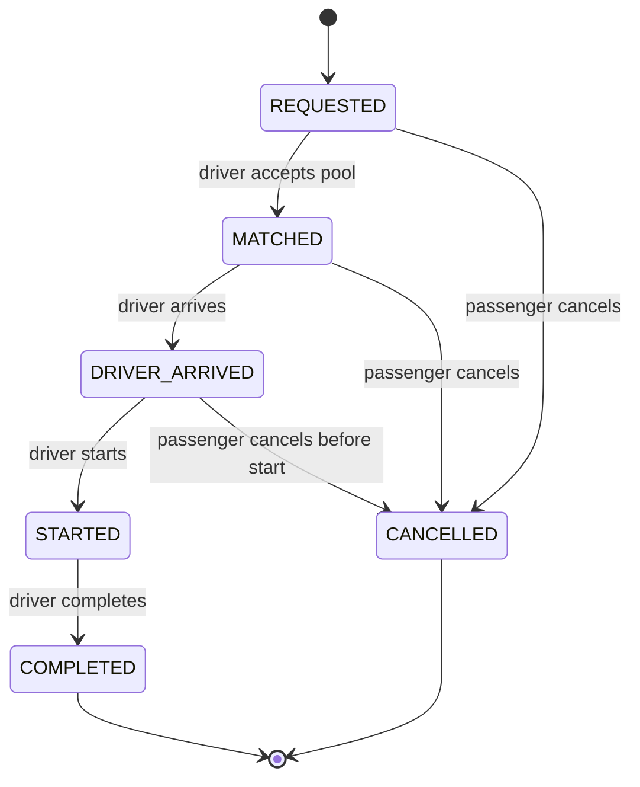

# Architecture

## MVP architecture



The frontend is deliberately thin: it renders state returned by the API and never owns capacity, fare, authorization, or lifecycle rules. Business invariants live in the API/database boundary.

## Ride and pool lifecycle



## Matching rule

The MVP does not call a routing API. Each Dhaka zone belongs to a coarse corridor. Two requests are compatible when:

1. the pool has not started;
2. pickup zones are identical or in the same pickup corridor;
3. destination zones are identical or in the same destination corridor; and
4. the requested seats fit the pool's remaining capacity.

The seed/demo case intentionally makes Banani -> Mohakhali and Banani -> Gulshan 1 compatible.

## Concurrency rule

`Pool.reservedSeats` is a denormalized counter used as the capacity guard. Joining a pool uses one conditional database update:

```sql
UPDATE "Pool"
SET "reservedSeats" = "reservedSeats" + :requestedSeats
WHERE id = :poolId
  AND "reservedSeats" <= "capacitySnapshot" - :requestedSeats;
```

Only a transaction whose update affects one row may create the membership. A database check constraint also requires `0 <= reservedSeats <= capacitySnapshot`. This prevents two simultaneous callers from both taking the final seat.
