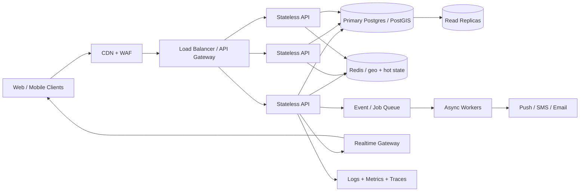

# If Oi Tesla Goes Viral: 1M Passengers / 100k Drivers

The MVP should **not** contain this infrastructure. This is the evolution path if load and product requirements justify it.

## Matching and location

- Replace static zones with PostGIS/geohash/H3-style spatial indexing and a routing/ETA provider.
- Separate **driver location** (high-write, ephemeral) from durable trip records. Keep hot location state in a purpose-built cache/store and periodically checkpoint what is needed for audits.
- Partition matching by geography so a request in Banani does not scan drivers in all of Bangladesh.
- Use short-lived reservation tokens/idempotency keys while matching to prevent duplicate acceptance.

## Database and contention

- Keep durable ride/payment state in relational storage because transactions still matter.
- Add indexes based on observed query plans, then read replicas for history/reporting reads.
- Partition large ride/history tables by time/region when table/index size warrants it.
- Keep the seat reservation operation atomic. At higher contention, use explicit row locks or a reservation table with uniqueness/idempotency guarantees rather than trusting cache-only counters.

## Async work

Use a queue/event bus only for work that does not need to complete in the request transaction: notifications, analytics, receipts, fraud/risk processing, search indexing, and downstream integrations. Use an outbox pattern so a committed ride transition cannot lose its event.

## Realtime

Move status/location updates to WebSockets or a managed realtime gateway. Persist authoritative state first; realtime messages are a delivery mechanism, not the source of truth.

## Reliability

- Idempotency keys on ride requests, driver actions, and payment operations.
- Timeouts, bounded retries with jitter, dead-letter handling for async jobs, and circuit breakers around external APIs.
- Multi-AZ database, tested backups/restore, deployment health gates, rolling/canary releases, and documented rollback.

## Security and abuse controls

- HTTP-only secure sessions/refresh rotation, device/session revocation, MFA where appropriate.
- Rate limiting by account/device/IP and stricter limits on auth and mutation endpoints.
- Secret manager, least-privilege service credentials, encryption in transit/at rest, audit logs, dependency/image scanning.
- Payment-token isolation and a real PSP rather than storing card data.

## Observability

Use structured logs, RED metrics (rate/errors/duration), database metrics, queue lag, matching latency, pool-fill rate, cancellation rate, and distributed traces. Alert on user-visible SLOs rather than CPU alone.
